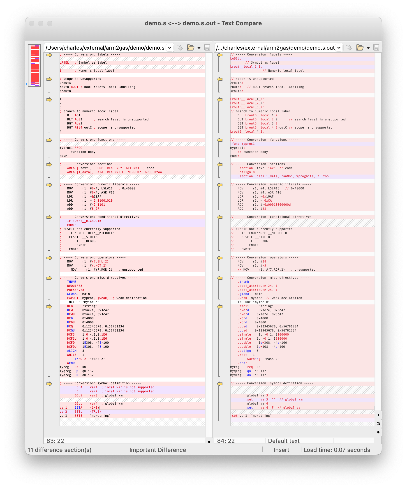

# objasm2gas

<div align="center">
<p>
      <a href="https://github.com/gerph/objasm2gas"></a>
      <a href="https://github.com/gerph/objasm2gas/blob/main/LICENSE"></a>
</p>
</div>
Migrate legacy ObjASM syntax assembly (as used on RISC OS) to GNU syntax (GAS).

## Usage

`objasm2gas.pl [<options>] <file1> [<file2>...]`

### Options

| Switch                  | Descriptions                                            |
| :---------------------- | :------------------------------------------------------ |
| `--compatible`          | Keeps compatibility with armclang assembler             |
| `-h, --help`            | Show this help text                                     |
| `-v, --verbose`         | Show a message on every non-trivial conversion          |
| `-n, --no-comment`      | Discard all the comments in output                      |
| `-o, --output=<file>`   | Specify the output filename                             |
| `-r, --return-code`     | Print return code definitions                           |
| `-s, --strict`          | Error on directives that have no equivalent counterparts |
| `-V, --version`         | Show version info                                       |
| `-w, --no-warning`      | Suppress all warning messages                           |
| `-x, --suffix=<string>` | Suffix of the output filename [default: '`.out`']       |
| `--inline`              | Process the `GET` and `INCLUDE` inline as objasm, rather than generating a GNU `as` include |
| `--simple-conditions`   | Leave conditions in GNU `as` form (default is to interpret `objasm` conditionals |
| `--test-expr=<expr>`    | Diagnostics for exercising the expression parser        |
| `--gas=<gas-binary>`    | GNU `as` to invoke to create ELF file, after conversion; output file will be the output from GNU `as` |
| `--bin`                 | When used with `--gas`, create a binary file (default is to produce an ELF file) |
| `--predefine=<asm>`     | Pre-execute a SETA, SETL or SETS directive.             |
| `--line-map=<file>`     | Output a map of output file line numbers to source lines. |
| `-i <paths>`            | Comma separated list of paths to search for inclues     |
| `--32`                  | Select 32 bit mode                                      |
| `--64`                  | Select 64 bit mode                                      |
| `--util`                | Create a Utility file, using 'riscos64-link' |
| `--aif`                 | Create a AIF Absolute file, using 'riscos64-link' |
| `--rmf`                 | Create a Relocatable Module file, using 'riscos64-link' |
| `--debug=<opts>`        | Selective enabling of debug options |


## Supported conversions

- [X] [Comments](https://developer.arm.com/documentation/dui0742/g/Migrating-ARM-syntax-assembly-code-to-GNU-syntax/Comments?lang=en)
- [X] [Labels](https://developer.arm.com/documentation/dui0742/g/Migrating-ARM-syntax-assembly-code-to-GNU-syntax/Labels?lang=en)
- [X] [Numeric local labels](https://developer.arm.com/documentation/dui0742/g/Migrating-ARM-syntax-assembly-code-to-GNU-syntax/Numeric-local-labels?lang=en)
- [X] [Functions](https://developer.arm.com/documentation/dui0742/g/Migrating-ARM-syntax-assembly-code-to-GNU-syntax/Functions?lang=en)
- [X] [Sections](https://developer.arm.com/documentation/dui0742/g/Migrating-ARM-syntax-assembly-code-to-GNU-syntax/Sections?lang=en)
- [X] [Symbols with special characters](https://developer.arm.com/documentation/dui0742/g/Migrating-ARM-syntax-assembly-code-to-GNU-syntax/Symbol-naming-rules?lang=en)
- [X] [Numeric literals](https://developer.arm.com/documentation/dui0742/g/Migrating-ARM-syntax-assembly-code-to-GNU-syntax/Numeric-literals?lang=en)
- [X] [Operators](https://developer.arm.com/documentation/dui0742/g/Migrating-ARM-syntax-assembly-code-to-GNU-syntax/Operators?lang=en)
- [X] [Aligment](https://developer.arm.com/documentation/dui0742/g/Migrating-ARM-syntax-assembly-code-to-GNU-syntax/Alignment?lang=en)
- [X] [PC-relative addressing](https://developer.arm.com/documentation/dui0742/g/Migrating-ARM-syntax-assembly-code-to-GNU-syntax/PC-relative-addressing?lang=en)
- [X] [Directives: Conditional](https://developer.arm.com/documentation/dui0742/g/Migrating-ARM-syntax-assembly-code-to-GNU-syntax/Conditional-directives?lang=en)
- [X] [Directives: Data definition](https://developer.arm.com/documentation/dui0742/g/Migrating-ARM-syntax-assembly-code-to-GNU-syntax/Data-definition-directives?lang=en)
- [X] [Directives: Instruction set](https://developer.arm.com/documentation/dui0742/g/Migrating-ARM-syntax-assembly-code-to-GNU-syntax/Instruction-set-directives?lang=en)
- [X] [Directives: Symbol definition](https://developer.arm.com/documentation/dui0742/g/Migrating-ARM-syntax-assembly-code-to-GNU-syntax/Symbol-definition-directives?lang=en)
- [X] [Directives: Miscellaneous](https://developer.arm.com/documentation/dui0742/g/Migrating-ARM-syntax-assembly-code-to-GNU-syntax/Miscellaneous-directives?lang=en)

- [X] `GET` and `INCLUDE` inline
- [X] RISC OS format filename handling
- [X] Macro expansion
- [X] Local variables within macros
- [X] Conditionals with expressions
- [ ] `WHILE` loops

## Extensions

In addition to the standard operations, the conversion includes a few
extensions to make using ObjAsm syntax a little easier.

Expression parsing:

* `$regs :REGLISTLEFT: $num` - a binary operator which returns the left most `$num` registers from the supplied register list.
* `$regs :REGLISTRIGHT: $num` - a binary operator which returns the right most `$num` registers from the supplied register list.
* `$regs :REGLISTSKIP: $num` - a binary operator which returns the supplied register list without the first `$num` registers.
* `$regs :REGLISTTRIM: $num` - a binary operator which returns the supplied register list without the last `$num` registers.


## Demo

Conversion result of `demo.s`:



Command-line output:

```bash
$ /objasm2gas.pl -v demo/demo.s
INFO: demo/demo.s:33 -> demo/demo.s.out:37: Converting '2_11001010' to hexadecimal literal '0xCA'
```


## Cautions

By default (without `--strict`), for those directives that have no equivalent GNU format, `objasm2gas` will try best to convert and generate warning information on the specific line. Therefore, a 'warning' does **NOT** necessarily mean no issue, please check the conversion result to ensure it works as expected.

Note that `objasm2gas` *assumes that the input file is in the **correct** syntax*, otherwise, the conversion result is **UNEXPECTED**

Use of `.` or `{PC}` may be unreliable in some circumstances. Try to simplify your expressions if
possible.

## TODO

- [ ] Loops
